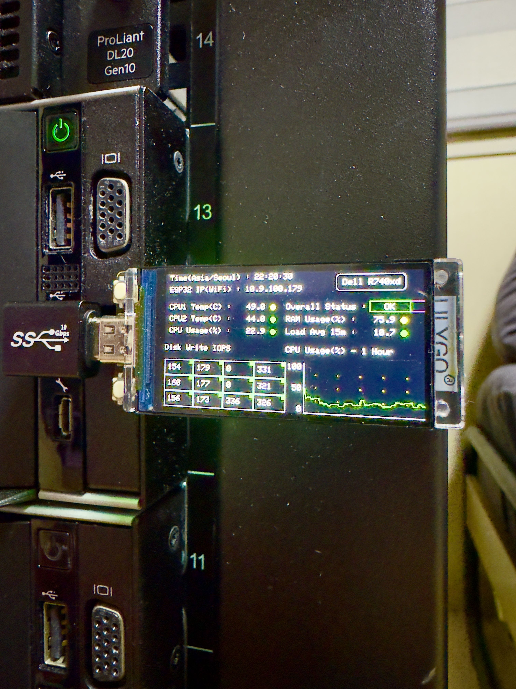
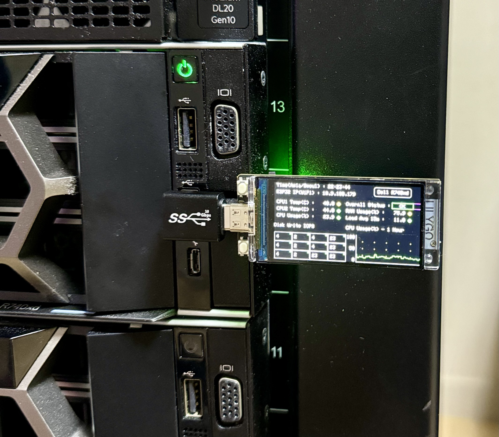

# esp32ServerMon
Offline server monitoring tool  
Any fixes or improvements are always welcome!!

## Working examples



## Available metrics on screen
- Current time
- Wifi address
- CPU usage in %
- CPU usage history graph
- CPU1/2 Temperature
- Memory usage in %
- Load Average (15m)
- Disk R/W IOPS (Cycles between read and write with a button)
- Disk health (green dots in top right corner of disk grid)
- Overall health **(Currently not implemented)**

## Tested environment
1. Hardware
    - Lilygo T-Display S3 (Non-touch version)
    - Dell R740xd
2. Software
    - PlatformIO w/ VSCode
    - ProxmoxVE 8
    - Python3.11

## Usage
#### First, upload the firmware to lilygo t-display s3
1. Install PlatformIO vscode plugin (install vscode first if not installed)
2. Clone this repo
3. Open repo directory in vscode
    - platformio should setup environment automatically
    - if not, check if platformio.ini file is visiable in vscode explorer.
4. Connect lilygo t-display s3 via USB
5. Start compile & upload
    - If you successfully installed PlatformIO, right arrow button should be visiable on the bottom left corner
6. Reset lilygo t-display s3 and check if default UI is loaded.

#### Next, Setup collector in Proxmox
1. Make sure python3.11 is installed
    - python3.11 is installed by default in Proxmox 8
2. Copy collector script
    ``` bash
    cd esp32servermon
    cp -r metrics-collector /opt/
    ```
3. Install python requirments
    ``` python
    cd /opt/metrics-collector
    python3 -m venv venv
    venv/bin/pip install -r requirments.txt
    ```
4. Copy systemd service file
5. Config collector script
    - Change DEVICE_NAME
    - Change BAUD_RATE **(Only if necessary)**
    - Change CHECK_INTERVAL **(Only if necessary)**
    ``` python
    DEVICE_NAME = "/dev/ttyACM0"
    BAUD_RATE = 115200
    CHECK_INTERVAL = 30
    ```
6. Run collector
    ``` bash
    systemctl daemon-reload
    systemctl start metrics-collector
    ```

#### Finally, check if all metrics are visiable in lilygo t-display s3
1. Press right button to check if diskIO cycles between read and write.
2. Check everything is working.

